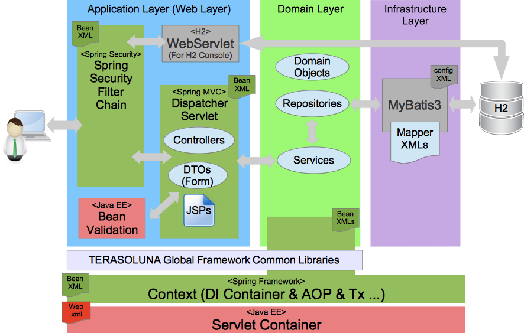
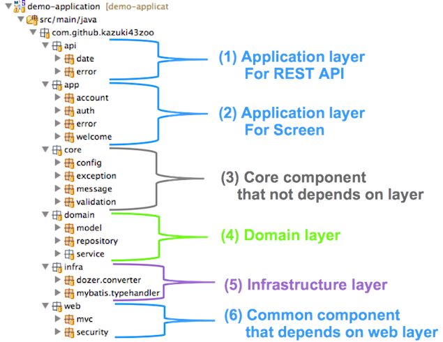
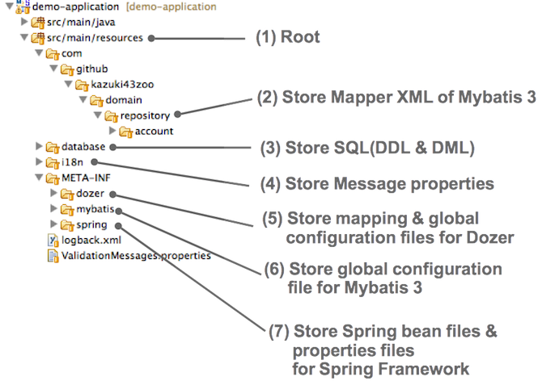
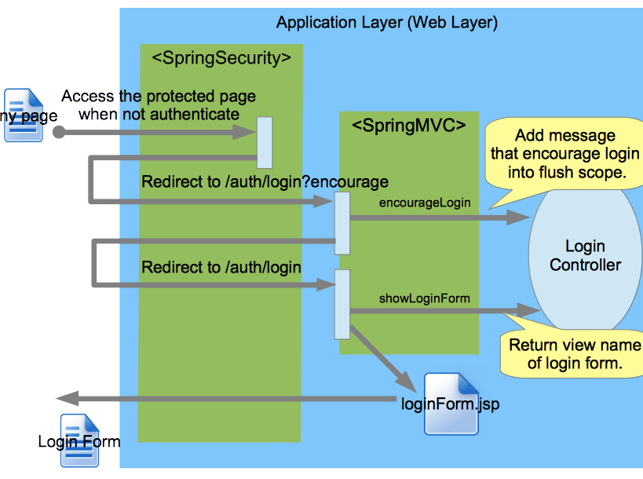
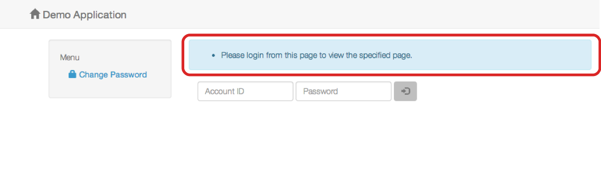
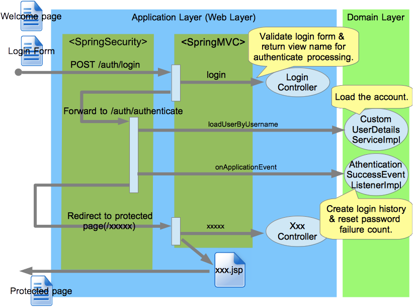
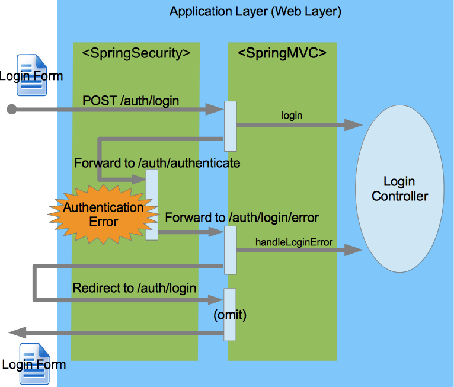
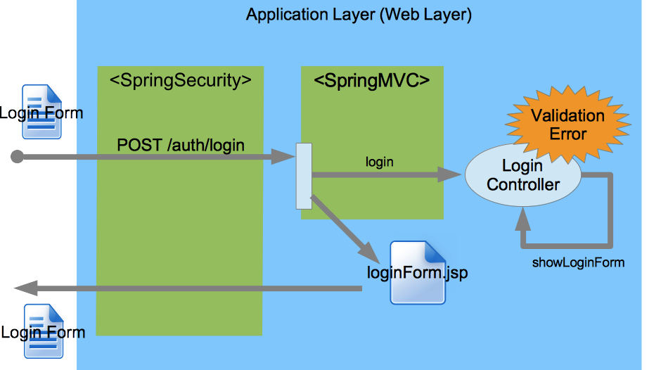
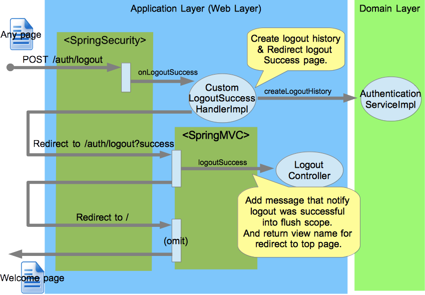

# Demo Application

This is sample application for develop using [TERASOLUNA Global Framework](http://terasoluna.org).<br>
**Currently, this application is under developing !!!**

# Application Overview

This application is developed based [TERASOLUNA Global Framework Development Guideline](http://terasolunaorg.github.io/guideline/).<br>
But it being customized by my opinion in the partially (this means is not 100% compliance by guideline).

## Application Structure

Structure of this application is following.<br><br>



| Layer | Component/Library | Main responsibilities |
| :-----: | --------- | --------------------- |
| Client Layer         | [JQuery 2.1.1](http://jquery.com/) | Provide the useful javascript operations. |
|                      | [AngularJS 1.2.20](https://angularjs.org/) | Provide the JavaScript MVW Framework |
|                      | [Bootstrap 3.2.0](http://getbootstrap.com/) | Provide the useful & stylish css configurations, and provide the useful client components(alert, message dialog, etc..). |
| Server Side Platform | Java SE 7 Java Virtual Machine | Provide the execution environment for Java application. | 
|                      | Java EE 6 Servlet Container | Provide the servlet engine that supports servlet 3.0 specification. | 
|                      | [Spirng Framework 4.0.6.RELEASE](http://docs.spring.io/spring/docs/4.0.6.RELEASE/spring-framework-reference/htmlsingle/) | Provide mechanism of CDI(Context and Dependency Inject). In this application, use the transaction management and AOP mechanism.|
| Application Layer    | [Spirng Security 3.2.5.CI-SNAPSHOT](http://docs.spring.io/spring-security/site/docs/3.2.5.CI-SNAPSHOT/reference/htmlsingle/) | Provide mechanism of security on web application. |
|                      | [Spirng MVC 4.0.6.RELEASE](http://docs.spring.io/spring/docs/4.0.6.RELEASE/spring-framework-reference/htmlsingle/#mvc) | Coming soon... |
|                      | [Bean Validation 1.1(JSR-349)](http://beanvalidation.org/1.1/) | Provide mechanism of validation for request data. In this application, use [Hivernate Validator 5.1.1.Final](http://docs.jboss.org/hibernate/validator/5.1/reference/en-US/html/) as implementation provider.|
|                      | Controllers | Handle a request & delegate a business procedure to the services.  |
|                      | DTOs(Forms) | Hold transfer data(form data) of application layer(web layer). |
|                      | JSPs | Generate presentation component(HTML) by accessing to DTOs and Domain Objects.  |
| Domain Layer         | Domain Objects | Hold domain data & implements core business logic. |
|                      | Repositories | Define & provide CRUD operations(interfaces) to the Domain objects. |
|                      | Services | Implements & provide business procedure(Part of the business logic) and provide transaction boundary. |
| Infrastructure Layer | [Mybatis 3.3.0-SNAPSHOT](http://mybatis.github.io/mybatis-3/) | Provide mechanism of database access. In this application, use the Mapper interface as Repository interface. SQL is implements in Mapper MXL. |
| Libraries               | [TERASOLUNA Global Framework Common Library 1.1.0-SNAPSHOT](https://github.com/terasolunaorg/terasoluna-gfw) | Provide useful functionalities on develop enterprise application. And provide dependency on useful OSS libraries([Dozer](http://dozer.sourceforge.net/), [Joda-Time](http://www.joda.org/joda-time/), [Apache-Commons families](http://commons.apache.org/), etc..). |

### Dependency libraries for project-specific
The following libraries is dependency for project-specific without relate on TERASOLUNA Global Framewrok.

| Library | Version | Description |
| ----- | :-----:| --------------------- |
| [org.apache.commons:commons-dbcp2](http://commons.apache.org/proper/commons-dbcp/) | 2.0.1 | Depends on to provide DataSource(Connection pooling) |
| [com.h2database:h2](http://www.h2database.com/) | 1.4.179 | Depends on to access H2 database. |
| [org.projectlombok:lombok](http://projectlombok.org/) | 1.14.4 | Depends on for automatically generate a methods(getter/setter/etc ...) of JavaBean. By the this library use, we can develop smoothly and effectively.<br>**If you are use IDE as Eclispe or STS(Spring Tool Suite) or NetBeans, please  install lombok.jar to the IED. In detail of how to install, please see [here](http://jnb.ociweb.com/jnb/jnbJan2010.html#installation).** |
| [com.fasterxml.jackson.core:jackson-databind](http://wiki.fasterxml.com/JacksonHome) | 2.4.1.1 | Depends on to bind JSON. |
| [com.fasterxml.jackson.datatype:jackson-datatype-joda](http://wiki.fasterxml.com/JacksonModuleJoda) | 2.4.1 | Depends on to use Joda-Time on the Jackson. |

### Version up of dependency libraries for project-specific  
The following libraries are version up from version that TERASOLUNA Global Framework depend on. Reason of version up is to try the latest version.

| Library | In this project | TERASOLUNA<br>Global Framework |
| ----- | :-----: | :-----: |
| org.springframework | 4.0.6.RELEASE | 3.2.8.RELEASE |
| org.springframework.security | 3.2.5.CI-SNAPSHOT | 3.1.4.RELEASE |
| org.springframework.data | 1.8.1.RELEASE  | 1.6.4.RELEASE |
| org.aspectj | 1.8.1 | 1.7.3 |
| org.codehaus.jackson | exclusion | 1.9.7 |
| org.slf4j | 1.7.7 | 1.7.5 |
| ch.qos.logback | 1.1.2 | 1.0.13 |
| org.hibernate.hibernate-validator | 5.1.1.Final | 4.3.1.Final |
| jboss-logging | 3.1.4.GA | 3.1.0.GA |
| org.mybatis | 3.3.0-SNAPSHOT | 3.2.7 |
| joda-time | 2.3 | 2.2 |
| dozer | 5.5.1 | 5.4.0 |
| com.google.guava | 17.0 | 13.0.1 |
| commons-beanutils | 1.9.2 | 1.8.3 |
| commons-lang | 3.3.2 | 3.1 |
| commons-dbcp | exclusion | 1.2.2.patch_DBCP264_DBCP372 |
| org.apache.tiles | 3.0.4 | 2.2.2 |

### Java package Structure



Coming soon...

### Resources package Structure



Coming soon...

### Web application(war) Structure

 Structure")

Coming soon...

## Application Functionalities

Functionalities of this application is following.<br>

| No | Functionality name | Description |
| :-----: | ----- | ----- |
| 1 | Welcome page | Coming soon... |
| 2 | Authentication | Coming soon... |
| 3 | Authorization | Coming soon... |
| 4 | Security Countermeasure | Coming soon... |
| 5 | Session Management | Coming soon... |
| 6 | Accounts Management | Coming soon... |
| 7 | My Profile Management | Coming soon... |
| 8 | Password Management | Coming soon... |
| 9 | Others... | Coming soon... |


# Functionality Details

## Authentication
This section describe about authentication in this application.<br>
In this application, authentication(login and logout) processing are implements using Spring Security and Spring MVC.<br>

* Spring Security has responsible for the authentication processing.
* Spring MVC has responsible for screen flow control.

### View the login form

Display processing flow of login form are following.



If access the protected page when not authenticate, spring-security redirect to the page that is defined in `login-page` attribute of `sec:form-login` element.

* `src/main/resources/META-INF/spring/spring-security.xml`

  ```xml
  <!-- omit -->
  <sec:http auto-config="true" use-expressions="true">
      <!-- omit -->
      <sec:form-login login-processing-url="/auth/authenticate" login-page="/auth/login?encourage"
          username-parameter="accountId" password-parameter="password"
          authentication-details-source-ref="customAuthenticationDetailsSource"
          authentication-failure-handler-ref="authenticationFailureHandler" />
      <!-- omit -->
  </sec:http>
  <!-- omit -->
  ```

Request of `GET /auth/login?encourage` and `GET /auth/login` are handled `LoginController`.

* `src/main/java/com/github/kazuki43zoo/app/auth/LoginController.java`

  ```java
  @RequestMapping("auth/login")
  @Controller
  public class LoginController {
      // omit

      @TransactionTokenCheck(type = TransactionTokenType.BEGIN)
      @RequestMapping(method = RequestMethod.GET)
      public String showLoginForm() {
          return "auth/loginForm";
      }

      @RequestMapping(method = RequestMethod.GET, params = "encourage")
      public String encourageLogin(RedirectAttributes redirectAttributes) {
          redirectAttributes.addFlashAttribute(Message.AUTH_ENCOURAGE_LOGIN.buildResultMessages());
          return "redirect:/auth/login";
      }

      // omit
  }
  ```

Generate screen data(response data) by the `auth/loginForm` view(JSP). In this application,have use the Tiles 3 as layout engine.

* `src/main/webapp/WEB-INF/views/auth/loginForm.jsp`

  ```jsp
  <c:if test="${!param.including}">
      <t:messagesPanel messagesAttributeName="SPRING_SECURITY_LAST_EXCEPTION" messagesType="danger" />
      <t:messagesPanel />
      <spring:hasBindErrors name="loginForm">
          <spring:nestedPath path="loginForm">
              <div class="alert alert-danger">
                  <form:errors path="*" />
              </div>
          </spring:nestedPath>
      </spring:hasBindErrors>
  </c:if>
  <form:form action="${contextPath}/auth/login" class="navbar-form" method="post" modelAttribute="loginForm">
      <div class="form-group">
          <form:input type="text" path="accountId" class="form-control" placeholder="Account ID" />
      </div>
      <div class="form-group">
          <form:password path="password" class="form-control" placeholder="Password" />
      </div>
      <button class="btn">
          <span class="glyphicon glyphicon-log-in"></span>
      </button>
  </form:form>
  ```

Actual screen(response) are following.




### Login(Authenticate)

In this application, authentication realize using the `DaoAuthenticationProvider` of spring-security.
`DaoAuthenticationProvider` has authenticate by using the user information that are loaded from the database.<br>
In `DaoAuthenticationProvider`, be able to check for the status of loaded user. Actually checking contents are following.

| No | Checking content | Specification in this application |
| :-----: | ----- | ----- |
| 1 | Specified user exists ? | Fetches the record that matches specified account id from the account table. If not exists matched record, occur the authentication error. |
| 2 | Specified user is not lock ? | Fetches the password failure count of fetched account. If it is over the max count of password failure count, occur the authentication error. |
| 3 | Specified user is enable ? | Fetches the enable flag of fetched account. If it is false(disabled), occur the authentication error. |
| 4 | Specified user is not expired ? | In this application, not support this checking. This means that check result is OK at always. |
| 5 | Specified user's password is not expired ? | Fetches the last modified date time of password. If it not modified during the password valid days period, encourage the password changing. |
| 6 | Matches the specified password ? | Fetches the passowrd. If it not matches the specified password, occur the authentication error as bad credential.  |

Login processing flow are following.



Login form implementation are following.<br>
In this application, parameter name of username and password has change the default settings of spring-security.

* `src/main/webapp/WEB-INF/views/auth/loginForm.jsp`

  ```jsp
  <form:form action="${contextPath}/auth/login" class="navbar-form" method="post" modelAttribute="loginForm">
      <div class="form-group">
          <form:input type="text" path="accountId" class="form-control" placeholder="Account ID" />
      </div>
      <div class="form-group">
          <form:password path="password" class="form-control" placeholder="Password" />
      </div>
      <button class="btn">
          <span class="glyphicon glyphicon-log-in"></span>
      </button>
  </form:form>
  ```

Receive the login request by the spring-mvc.<br>
In this application, `LoginController` receive the login request, and execute validation of login form data. If not exists violation, `LoginContoller` forward to the authentication processing of spring-security.

* `src/main/java/com/github/kazuki43zoo/app/auth/LoginController.java`

  ```java
  @RequestMapping("auth/login")
  @Controller
  public class LoginController {
      // omit

      @TransactionTokenCheck
      @RequestMapping(method = RequestMethod.POST)
      public String login(@Validated LoginForm form, BindingResult bindingResult) {

          if (bindingResult.hasErrors()) {
              return showLoginForm();
          }

          return "forward:/auth/authenticate";
      }

      // omit
  }
  ```

* `src/main/java/com/github/kazuki43zoo/app/auth/LoginForm.java`

  ```java
  @AllArgsConstructor
  @NoArgsConstructor
  @Data
  public class LoginForm implements Serializable {
      private static final long serialVersionUID = 1L;
      @NotNull
      private String accountId;
      @NotNull
      private String password;
  }
  ```

Receive the login(authentication) request by the spring-security.<br>
spring-security execute the authentication processing when was accessed to the url that is defined in `login-processing-url` attribute of `sec:form-login` element.
In this application, `login-processing-url` & `username-parameter` & `password-parameter` attribute of `sec:form-login` element has change the default settings of spring-security.<br>
Reason of changing default settings is to hide the fact that are using the spring-security as security countermeasure. If occur the security vulnerability in the spring-security, be able to reduce the risk of attack to this application.

* `src/main/resources/META-INF/spring/spring-security.xml`

  ```xml
  <!-- omit -->
  <sec:http auto-config="true" use-expressions="true">
      <!-- omit -->
      <sec:form-login login-processing-url="/auth/authenticate" login-page="/auth/login?encourage"
          username-parameter="accountId" password-parameter="password"
          authentication-details-source-ref="customAuthenticationDetailsSource"
          authentication-failure-handler-ref="authenticationFailureHandler" />
      <!-- omit -->
  </sec:http>
  <!-- omit -->
  ```

Load the user information and create instance of the `CustomUserDetails` (extended class in this application).
In this application, load the user information via the `CustomUserDetailService` (extended class in this application).


description coming soon...

### Handle login error



description coming soon...

### Handle validation error



description coming soon...

### Logout



description coming soon...

### Logout by session timeout
Coming soon...

## Authorization
This section describe about authorization in this application.<br>
In this application, authorization(access control of protected page) processing are implements using Spring Security.<br>

Coming soon...

## Other Security Countermeasure
This section describe about other security countermeasure in this application.<br>

### Session Fixation Attacks Protection
Coming soon...

* `src/main/resources/META-INF/spring/spring-security.xml`

  ```xml
  <!-- omit -->
  <sec:http auto-config="true" use-expressions="true">
      <!-- omit -->
      <sec:session-management invalid-session-url="/error/invalidSession"
          session-fixation-protection="migrateSession"  />
      <!-- omit -->
  </sec:http>
  <!-- omit -->
  ```

### CSRF Attacks Protection
Coming soon...

* `src/main/resources/META-INF/spring/spring-security.xml`

  ```xml
  <!-- omit -->
  <sec:http auto-config="true" use-expressions="true">
      <!-- omit -->
      <sec:csrf request-matcher-ref="csrfRequestMatcher" />
      <!-- omit -->
  </sec:http>
  <!-- omit -->
  ```
  ```xml
  <!-- omit -->
  <bean id="csrfRequestMatcher" class="org.springframework.security.web.util.matcher.AndRequestMatcher">
      <constructor-arg>
          <list>
              <ref bean="defaultCsrfRequiresMethodMatcher" />
              <bean class="org.springframework.security.web.util.matcher.NegatedRequestMatcher">
                  <constructor-arg ref="csrfExclusionPathMatcher" />
              </bean>
          </list>
      </constructor-arg>
  </bean>
  <bean id="csrfExclusionPathMatcher" class="org.springframework.security.web.util.matcher.OrRequestMatcher">
      <constructor-arg>
          <list>
              <bean id="h2ConsolePathMatcher" class="org.springframework.security.web.util.matcher.AntPathRequestMatcher">
                  <constructor-arg index="0" value="/vendor/h2/**" />
              </bean>
          </list>
      </constructor-arg>
  </bean>
  <!-- omit -->
  ```

### XSS attacks Protection
Coming soon...

* `src/main/resources/META-INF/spring/spring-security.xml`

  ```xml
  <!-- omit -->
  <sec:http auto-config="true" use-expressions="true">
      <!-- omit -->
      <sec:headers>
          <!-- omit -->
          <sec:content-type-options />
          <sec:xss-protection/>
      </sec:headers>
      <!-- omit -->
  </sec:http>
  <!-- omit -->
  ```

### Clickjacking Attacks Protection
Coming soon...

* `src/main/resources/META-INF/spring/spring-security.xml`

  ```xml
  <!-- omit -->
  <sec:http auto-config="true" use-expressions="true">
      <!-- omit -->
      <sec:headers>
          <!-- omit -->
          <sec:frame-options policy="SAMEORIGIN" />
          <!-- omit -->
      </sec:headers>
      <!-- omit -->
  </sec:http>
  <!-- omit -->
  ```

### Directory Traversal Attacks Protection
Coming soon...


### Protected resource not cache

* `src/main/resources/META-INF/spring/spring-security.xml`

  ```xml
  <!-- omit -->
  <sec:http auto-config="true" use-expressions="true">
      <!-- omit -->
      <sec:headers>
          <sec:cache-control />
          <!-- omit -->
      </sec:headers>
      <!-- omit -->
  </sec:http>
  <!-- omit -->
  ```

### HTTP Strict Transport Security (HSTS)
Coming soon...

* `src/main/resources/META-INF/spring/spring-security.xml`

  ```xml
  <!-- omit -->
  <sec:http auto-config="true" use-expressions="true">
      <!-- omit -->
      <sec:headers>
          <!-- omit -->
          <sec:hsts />
          <!-- omit -->
      </sec:headers>
      <!-- omit -->
  </sec:http>
  <!-- omit -->
  ```


## Session Management
This section describe about session management in this application.<br>

### Detect Session timeout
Coming soon...

